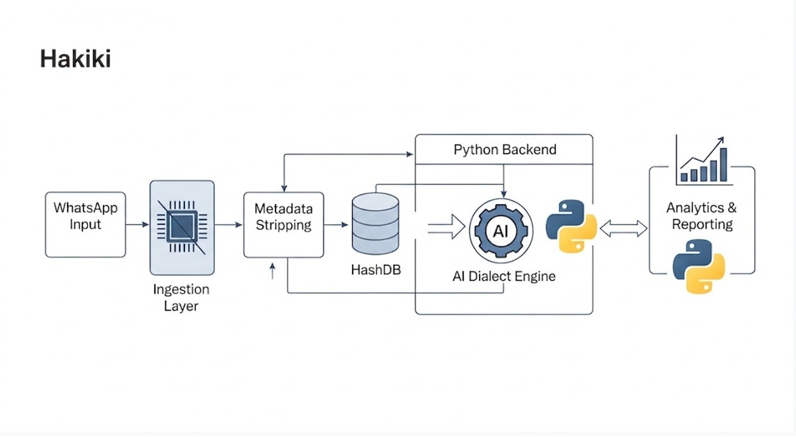

# Hakiki — The Truth Engine for Kenya's 2027 Elections

> Built during the **Democracy & AI Hackathon** — July 4th, 2026
> Hosted by **Mozilla Foundation** & **KamiLimu**

---

## Team

| Name | Role | GitHub |
|------|------|--------|
| Addy Mutuiri| Backend Engineer | [@Addy](https://github.com/mutuiris) |
| Joan Ouma| Full-Stack Developer | [@joan-ouma](https://github.com/joan-ouma) |

**Team Name:** T004  
**University:** Addy - Kenyatta University, Joan - Jomo Kenyatta University  

---

## Problem & User

### Problem Statement
First time Generation Z voters aged 18 - 29 in Kenya, especially those who consume political
narratives on TikTok, encounter a high volume of unverified, AI altered media. With internet
subscriptions exceeding 40 million, TikTok has secured a 30.3% share of the local market. The 2025
Reuters Institute Digital News Report indicates that while 38% of Kenyans turn to TikTok for news,
55% of users acknowledge the platform as a primary channel for circulating deceptive and misleading
content.

### Target User

| Dimension | Detail |
|-----------|--------|
| **Primary user** | Gen Z digital natives (WhatsApp/TikTok) and rural citizens (SMS/USSD) |
| **Tech comfort** | Very comfortable with forwarding WhatsApp voice notes and text, or dialing USSD codes. |
| **Language** | Swahili, Sheng, and English |
| **Current workflow** | Hears a rumor on a WhatsApp group or TikTok share, but has no way to fact-check it instantly. |

### The Specific Gap

1. **What's already there:** THRAETS, a pro-democracy civic tech organization, built "Community Fakes," a crowdsourcing platform addressing the gap in Western AI detection tools by relying on local human intelligence to spot regional deepfakes. They also developed "Spot the Fakes," a gamified quiz to train users.
2. **Why it falls short:** However, a significant gap remains regarding digital literacy and connectivity. These digital only tools require stable bandwidth, inadvertently excluding rural and offline populations who rely heavily on vulnerable vernacular radio broadcasts, creating a massive last mile delivery challenge for isolated voters.
3. **The gap we fill:** Hakiki provides a lightweight, WhatsApp-native and SMS/USSD verification chatbot. You forward a claim or video directly in the chat, and Hakiki uses a localized AI model to analyze the media in Kenyan dialects—intercepting deepfakes at the exact moment they are encountered, before the user decides to re-share.

### Why It Matters
When election deepfakes and synthetic political content spread rapidly because voters can't easily spot them, the accountability loop breaks. By instantly intercepting and flagging synthetic media at the point of sharing, Hakiki prevents the viral spread of manufactured doubt and actively protects the democratic participation of marginalized voters.

---

## 🚀 Run Instructions

### Prerequisites
- Python 3.10+
- Ngrok (for testing webhooks)
- API Keys: Twilio, Africa's Talking, DeepSeek, Groq, Firecrawl, Google Fact Check Tools.

### Quick Start

```bash
# 1. Clone the repo
git clone https://github.com/joan-ouma/hakiki_project.git
cd hakiki_project

# 2. Install dependencies
pip install -r requirements.txt

# 3. Set environment variables
cp .env.example .env
# Open .env and add your API keys!

# 4. Seed the Database
# Uses Firecrawl and DeepSeek to scrape real Auditor-General news into SQLite.
PYTHONPATH=. python3 scripts/seed.py

# 5. Run the FastAPI Server
uvicorn src.main:app --reload

# 6. Expose to the Internet (in a new terminal)
ngrok http 8000
```
*(Copy the Ngrok URL and set it as your webhook in the Twilio and Africa's Talking consoles!)*

---

## 📁 Project Structure

```
.
├── README.md                   ← You are here
├── src/
│   ├── main.py                 ← FastAPI entry point & Routers
│   ├── config.py               ← Environment variable loader
│   ├── privacy.py              ← Zero-PII stripping & hashing
│   ├── cache.py                ← Media hashing & caching
│   ├── store.py                ← SQLite DB schema logic
│   ├── channels/               
│   │   ├── whatsapp.py         ← Twilio WhatsApp webhook logic
│   └── engine/
│       ├── claim.py            ← DeepSeek claim extraction
│       ├── match.py            ← DB & Google Fact Check matching
│       ├── media.py            ← Groq Whisper & HF ViT inference
│       └── verdict.py          ← Symmetric confidence gating
├── scripts/
│   ├── seed.py                 ← Live Firecrawl NG-CDF scraper
├── data/
│   └── hakiki.db               ← Zero-PII local cache & fact database
└── requirements.txt            
```

---

## 🧠 Architecture & Tech Stack

Hakiki is built as a highly modular, async-first fact-checking engine designed to directly address the technical and ethical constraints of the Kenyan 2027 elections.

### 1. Model Specifics & Design Pivots
*   **Audio Transcription (Groq Whisper):** We initially explored local open-weights models (`PaschalK/whisper-swahili-small`) but encountered integration difficulties and unacceptable inaccuracies with heavy dialects. We pivoted to **Groq's API running `whisper-large-v3`** (an open-weights model). This guarantees lightning-fast transcription capable of handling Swahili and Sheng at the speed required for a real-time WhatsApp bot.
*   **Visual Deepfakes (Hugging Face ViT):** For visual media, we utilize the local Hugging Face model `dima806/deepfake_vs_real_image_detection`. This is a Vision Transformer (ViT) fine-tuned on the "Hard Fake vs Real Faces" dataset, allowing us to detect synthetic alterations directly on our own infrastructure.
*   **Fact Extraction (DeepSeek):** We utilize `deepseek-chat` for LLM reasoning to translate Sheng/Swahili conversational text into concrete, search-ready factual claims.

### 2. Data Layer
`scripts/seed.py` uses Firecrawl to pull live Auditor-General reports directly from Kenyan government and news sites. It uses DeepSeek to intelligently extract the core findings into a local SQLite DB for instant offline matching.

### 3. Responsible Computing: Specific Privacy Mechanisms
To protect vulnerable voters and civic activists from state surveillance, Hakiki implements **Zero-PII Processing by design**. 
*   **Mechanism:** Our `privacy.py` script acts as a middleware gateway. It uses strict RegEx to instantly scrub and salt-hash all phone numbers (`[REDACTED_PHONE]`) *in-memory* before any AI processing or logging occurs. 
*   **Impact:** Absolutely zero personal metadata is written to disk or sent to external inference APIs.

```mermaid
graph TD
  User[User (WhatsApp/SMS)] --> API[FastAPI Webhook]
  API --> Privacy[Zero-PII Filter]
  Privacy --> Media[Groq Whisper / HF ViT]
  Privacy --> Extract[DeepSeek Claim Extraction]
  Media --> Match
  Extract --> Match[Local DB / Google Fact Check]
  Match --> Verdict[Symmetric Confidence Gating]
  Verdict --> User
```

*(Alternatively, view our comprehensive visual architecture below:)*  


---

## 📅 Project Roadmap: Built Today vs. Future

### What We Built Today (Phase 1 & 2)
1. **Core Verification Engine:** The fully functional backend (FastAPI) capable of routing WhatsApp and SMS requests.
2. **Zero-PII Gateway:** Hardened privacy filter (`privacy.py`) that strictly scrubs personal data before any AI processing.
3. **AI Inference Pipeline:** 
   - DeepSeek for rapid text claim extraction.
   - Groq API (`whisper-large-v3`) for ultra-fast audio transcription.
   - Local Hugging Face ViT (`dima806`) for visual deepfake detection.
4. **Automated Fact Seeding:** Firecrawl script (`scripts/seed.py`) securely pulling live Auditor-General NG-CDF reports.
5. **Local HashDB:** SQLite database functioning as our low-latency truth cache.

### What We Will Build Next (Phase 3 & Beyond)
1. **Vernacular Radio Ingestion (Radio Input):** Expanding our ingestion layer to continuously monitor vulnerable local vernacular radio broadcasts and automatically flag synthesized audio manipulation in real-time.
2. **Analytics & Reporting Dashboard:** A secure, web-based UI for civil society organizations and journalists to visualize localized misinformation trends, track viral deepfakes by region, and measure the impact of fact-checking interventions.
3. **WhatsApp Group Demo Automation:** An automated Twilio script to instantly create test groups and invite hackathon judges/voters for bulk demonstration.

---

## License

MIT © T004, 2026
